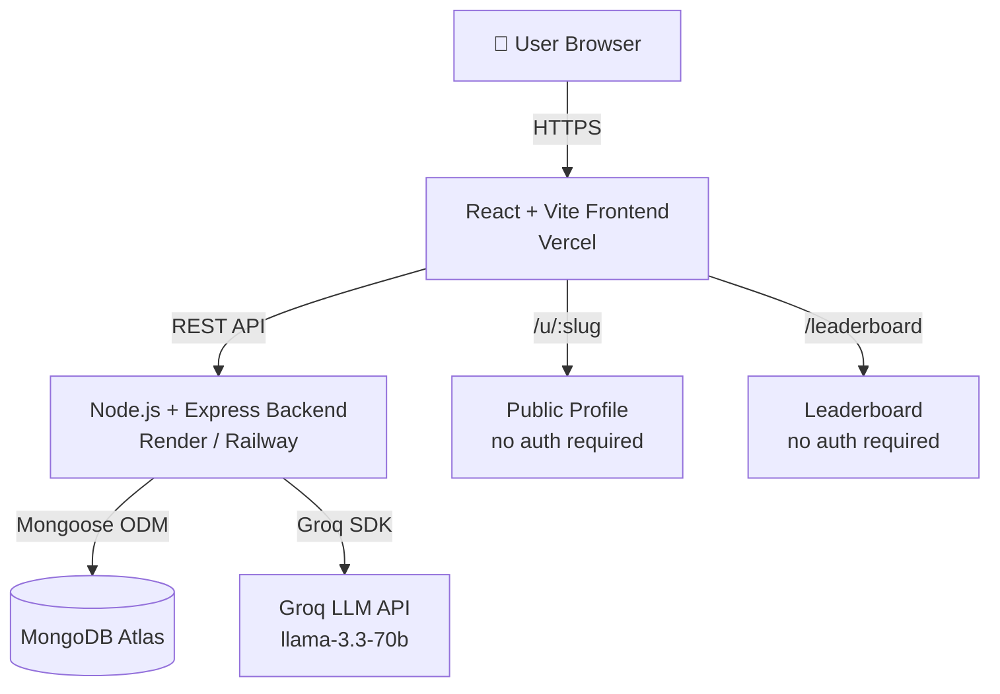

# SkillProof — System Architecture

## Overview

SkillProof is an AI-powered developer evaluation platform. Developers submit GitHub projects, receive multi-dimensional AI scoring, and can share their results publicly. Built with React + Vite (frontend), Node.js + Express (backend), MongoDB (data), and Groq LLM (AI).

---

## Architecture Diagram



---

## Request Lifecycle — Project Evaluation

```
1. POST /api/projects (authenticated)
   │
   ├── 1. Auth middleware verifies JWT, attaches user to req
   ├── 2. express-validator validates title, githubUrl, description
   ├── 3. Project saved to DB with status = "processing"
   ├── 4. AI evaluation called (Groq SDK, 30s timeout)
   │       └── Returns 5 dimension scores + company-fit + resume bullets
   ├── 5. calculateFinalScore() — deterministic weighted formula (server-owned)
   ├── 6. Project updated with scores, AI metadata, status = "evaluated"
   ├── 7. User.aiTokensUsed incremented with token count
   └── 8. 201 response with full project object
```

**Why is the final score server-computed?**
- Reproducibility — changing AI model doesn't change the scoring formula
- Security — clients cannot manipulate scores
- Auditability — formula is versioned (`SCORE_VERSION`) and documented

---

## AI Evaluation Flow

```
┌─────────────────────────────────────────────────────┐
│ System Prompt (PROMPT_VERSION: v2.1)                │
│ - Evaluation rubric (1–10 per dimension)            │
│ - Company-fit definitions (google/startup/mnc)      │
│ - Format: strict JSON schema                        │
└─────────────────────────────────────────────────────┘
         │
         ▼
┌─────────────────────────────────────────────────────┐
│ User Prompt                                         │
│ - Project title, description, GitHub URL, techStack │
└─────────────────────────────────────────────────────┘
         │
         ▼
┌─────────────────────────────────────────────────────┐
│ Groq (llama-3.3-70b-versatile)                     │
│ response_format: json_object                        │
│ temperature: 0.2 (low for consistency)              │
│ timeout: 30s with AbortController                   │
└─────────────────────────────────────────────────────┘
         │
         ▼
  Fallback if AI fails: zeros + fallback:true flag
         │
         ▼
┌─────────────────────────────────────────────────────┐
│ scoreCalculator.js — deterministic formula          │
│ finalScore = weighted(arch*0.25 + scale*0.20 +      │
│   quality*0.25 + innov*0.15 + impact*0.15) * 10     │
│ Result: 0–100 integer                               │
└─────────────────────────────────────────────────────┘
```

**Stored with every evaluation:**
| Field | Purpose |
|---|---|
| `aiModelVersion` | Reproducibility — which model scored this |
| `promptVersion` | Reproducibility — which prompt was used |
| `tokenUsage` | Cost tracking per evaluation |
| `confidenceScore` | AI self-reported confidence (0–100) |
| `evaluatedAt` | Timestamp for debugging |
| `fallback` | True if AI failed and zeros were returned |

---

## Database Schema — Key Collections

### Users
```
_id, name, email, password (bcrypt), role
publicProfileSlug, publicProfileEnabled, bio, avatarUrl
aiTokensUsed, aiCostUsd
achievements[]
```
**Indexes:** `{ email: 1 }`, `{ publicProfileSlug: 1 }`

### Projects
```
_id, user (ref), title, githubUrl, description, techStack[]
status: pending | processing | evaluated | failed
finalScore (0–100), evaluation { ...scores, companyFit, resumeBullets, metadata }
isPublic, timestamps
```
**Indexes:**
- `{ user: 1, createdAt: -1 }` — user's project list
- `{ finalScore: -1 }` — leaderboard sort
- `{ status: 1, finalScore: -1 }` — leaderboard filter
- `{ createdAt: -1 }` — global feed

---

## Scaling Strategy — 1M Users

### Current State (0–10K users)
- Single Node.js process on Render/Railway
- MongoDB Atlas M0 free tier → M10 as needed
- Groq API for AI (serverless, no infra)

### 10K → 100K Users
```
Load Balancer (Render/Railway auto-scale)
    ├── Node instance 1
    ├── Node instance 2
    └── Node instance N (stateless — JWT, no sessions)

MongoDB Atlas M30 with replica set
Redis (Upstash) for:
    ├── Leaderboard cache (5-min TTL)
    ├── Public profile cache (1-min TTL)
    └── Rate limit counters
```

### 100K → 1M Users
```
API Gateway (AWS API GW or Cloudflare)
    ├── Auth Service (lightweight — JWT verify)
    ├── Project Service (CRUD + metadata)
    ├── AI Evaluation Worker (async queue)
    │       └── BullMQ + Redis for job queue
    │           └── Worker pulls jobs, calls Groq, updates DB
    └── Profile/Leaderboard Service (read-heavy, cached)

MongoDB Atlas M50+ with sharding on userId
CDN (Cloudflare) for static assets + public profiles
```

---

## Caching Strategy

| Resource | TTL | Strategy |
|---|---|---|
| Leaderboard | 5 min | Server-side Redis, invalidate on new evaluation |
| Public profile | 1 min | Redis key by slug |
| Static assets | 1 year | Vercel CDN (content-hashed filenames) |
| AI responses | Not cached | Non-deterministic, project-specific |

---

## Rate Limiting

| Route | Window | Max Requests | Rationale |
|---|---|---|---|
| `/api/auth/*` | 15 min | 20 | Brute-force protection |
| `/api/projects` | 60 min | 10 | AI calls cost money |
| All other routes | 15 min | 200 | General abuse prevention |

Production: move to Redis-backed rate limiter (e.g., `rate-limit-redis`) for consistency across multiple instances.

---

## AI Cost Optimization

1. **Model selection**: `llama-3.3-70b-versatile` via Groq is free/cheap vs GPT-4
2. **Temperature 0.2**: Low temperature = shorter, more deterministic outputs = fewer tokens
3. **JSON mode**: `response_format: json_object` prevents long prose responses
4. **Token tracking**: Every evaluation records `tokenUsage` on the project document
5. **User-level tracking**: `user.aiTokensUsed` for cost attribution
6. **Timeout**: 30s AbortController prevents runaway requests
7. **Future**: Cache evaluations for same GitHub URL + description hash

---

## Failure Recovery

| Failure | Behavior |
|---|---|
| Groq API down | Returns fallback evaluation (zeros, `fallback:true`), project saved as `failed` |
| Groq timeout (30s) | Same as above, AbortController fires |
| MongoDB down | Express 503 via errorHandler |
| Invalid AI JSON | `JSON.parse` throws → caught → fallback returned |
| Server crash | Graceful SIGTERM handler closes DB connection cleanly |

---

## Security Model

- **JWT auth** — `HS256`, 7-day expiry, stored in localStorage (upgrade to httpOnly cookie for production)
- **Helmet.js** — sets 11 security headers
- **CORS** — explicit allowlist from `CORS_ORIGIN` env var
- **Input validation** — express-validator on all write routes
- **Password hashing** — bcryptjs, salt rounds 10
- **Ownership checks** — every project read/write verifies `project.user === req.user._id`
- **Rate limiting** — per-route limits on auth and eval endpoints

---

## Deployment

### Backend (Render / Railway)
```bash
# Build command
npm install

# Start command
node server.js

# Environment variables (set in dashboard)
PORT, NODE_ENV, MONGO_URI, JWT_SECRET, GROQ_API_KEY, CORS_ORIGIN
```

### Frontend (Vercel)
```bash
# Build command
npm run build

# Output directory
dist

# Environment variable
VITE_API_URL=https://your-backend.onrender.com/api
```

> Also update `frontend/src/api/axios.js` baseURL to use `import.meta.env.VITE_API_URL` in production.

